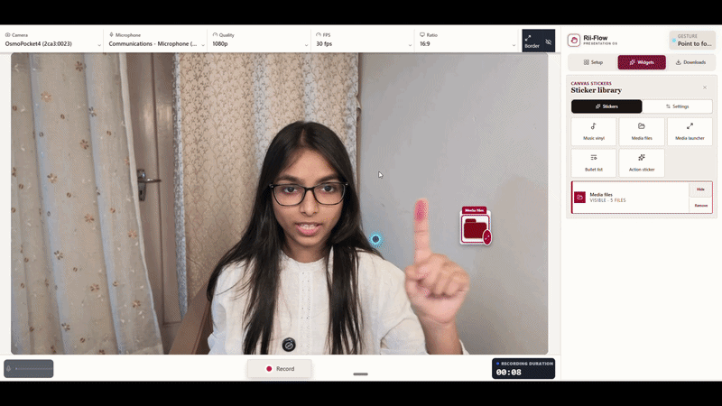

# Rii-Flow

Make gesture-controlled talking-head videos while you are still presenting—no timeline required.

Rii-Flow turns your camera into a live recording workspace. Bring in photos and videos, arrange them into scenes, open media with hand gestures, add captions and record the finished canvas in one pass.

<p align="center">
  <a href="https://riitree.github.io/Rii-Flow/"><strong>Try Rii-Flow live →</strong></a>
</p>

<p align="center">
  
</p>

## Run Rii-Flow on your computer

### What you need

- Windows, macOS or Linux
- [Node.js 20 LTS or newer](https://nodejs.org/)
- A current version of Google Chrome or Microsoft Edge
- A camera and microphone
- At least 500 MB of free space for the app and its browser models, plus space for your recordings
- Internet access for the first download and `npm install`

Rii-Flow runs locally in the browser. There is no server or account to configure, and your imported media is not uploaded anywhere.

For a lower-powered computer, start with **720p at 30 fps** inside Rii-Flow. Move to 1080p only after a short test recording plays smoothly.

### 1. Download the project

Open Terminal, PowerShell or Command Prompt and run:

```bash
git clone https://github.com/riitree/Rii-Flow.git
cd Rii-Flow
```

No Git? Download the repository as a ZIP from GitHub, extract it, open a terminal inside the extracted folder and continue below.

### 2. Install and start it

```bash
npm install
npm run dev
```

Open the local address printed in the terminal—normally [http://localhost:5173](http://localhost:5173).

Allow camera and microphone access when the browser asks. That is it: Rii-Flow is running.

### 3. Make your first video

The studio guides you through one path:

1. **Choose the recording destination.** Pick where completed recordings should be saved.
2. **Import media.** Add as many photos and videos as you need. Crop photos, trim videos, and choose each asset's entrance, sound, size and optional gesture.
3. **Build scenes.** Group media that should appear together, then assign a scene to an orbit widget or a direct gesture.
4. **Choose a deck layout.** Use the clean horizontal deck, side-by-side layout or a freeform canvas.
5. **Add embellishments.** Add only what the video needs: a music player, list, scene orbit or live control.
6. **Record.** Perform on the canvas, stop the recording, then download it or adjust caption and punch-line timing.

Everything visible on the recording canvas—including media decks, scene orbits, widgets and captions—is included in the finished video.

## The gesture language

The common actions stay the same everywhere:

| Gesture | Action |
| --- | --- |
| Point and hold | Focus or open a deck item, scene or widget |
| Thumbs up | Show or hide the classic media deck |
| Open palm over an asset | Pick it up and move it |
| Two palms | Resize the focused asset without rotating it |
| Open palm near the deck | Flick and scroll the deck |
| One fist | Close the current item; close the deck when no item is focused |
| Two fists | Hide everything on the canvas |

Media and scenes outside the universal controls can also be assigned to the available direct gestures, such as two, three or four fingers.

## What is included

- Camera, microphone and screen-share recording
- Photos and video assets with crop, trim and one-shot playback
- Per-asset entrance animation, sound, spawn size and gesture assignment
- Scene groups and customizable orbit widgets
- Clean, side-by-side and freeform deck layouts
- Movable and resizable assets and widgets with remembered placement
- Music playback mixed with the microphone instead of replacing it
- Live/screen-share layouts with picture-in-picture camera
- Local Whisper captions with editable caption and punch-line timing
- A local recording library with rename, trim, caption and download tools

## Recording cleanly

- Use **Chrome or Edge**. Safari and Firefox do not consistently expose the same MP4 recording and folder-access features.
- Close video-heavy tabs before recording on a slower computer.
- Start at **720p / 30 fps**, make a ten-second test, and inspect the downloaded file before a long take.
- Share a different tab, window or monitor. Sharing the Rii-Flow canvas itself creates the familiar infinite-mirror effect.
- Keep your hand inside the camera frame for the most reliable full-hand gestures. Pointing uses the index fingertip so it can still work near the edge of the frame.

## Captions and privacy

Rii-Flow uses Whisper locally for post-recording captions. The model runs in the browser through Transformers.js and ONNX Runtime Web; it is **not** used for voice commands or keyword control. The first caption run may take longer while the browser caches the model.

Imported assets, recordings and generated captions remain on your computer unless you choose to share them.

## Production build

To verify and build the project:

```bash
npm run check
npm run build
```

To preview the production build locally:

```bash
npm run preview
```

The deployable site is generated in `dist/`.

## Tech stack

- React + TypeScript + Vite
- MediaPipe Tasks Vision for hand tracking
- Canvas capture + MediaRecorder for the final recording
- Web Audio API for microphone, video and music mixing
- Transformers.js + Whisper + ONNX Runtime Web for local captions
- IndexedDB and browser file APIs for local media and recordings

## Troubleshooting

### The camera is blank

Open the browser's site permissions, allow camera and microphone access, then reload the page.

### The terminal says `npm` is not recognized

Install Node.js 20 LTS, close and reopen the terminal, then run `npm install` again.

### The recording stutters

Select 720p and 30 fps, close other camera/video apps, turn off unused widgets and make a new short test.

### A screen share mirrors forever

Stop sharing the Rii-Flow tab or browser window and choose the actual tab, application window or monitor you want viewers to see.

### Captions take time on the first run

Keep the page open. The local caption model must be loaded and cached once; later runs are faster.

---

Rii-Flow is built for the moment between an idea and a finished video: import, arrange, perform, record.
